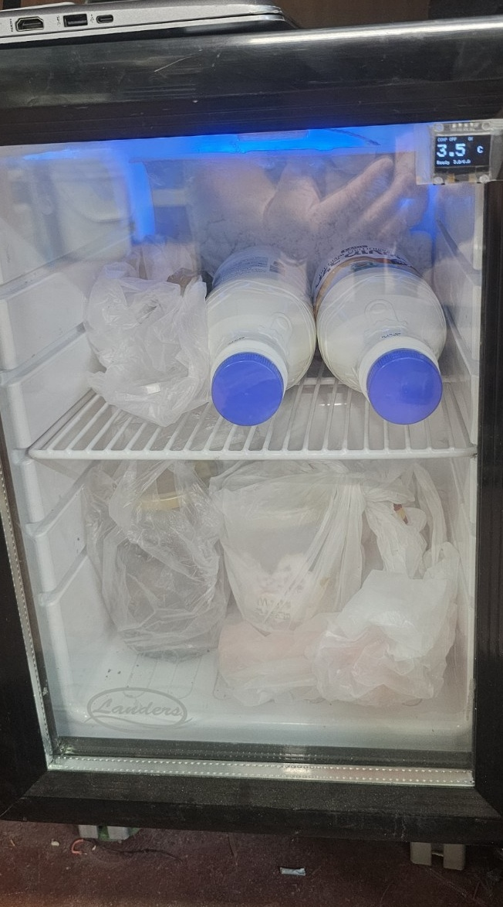
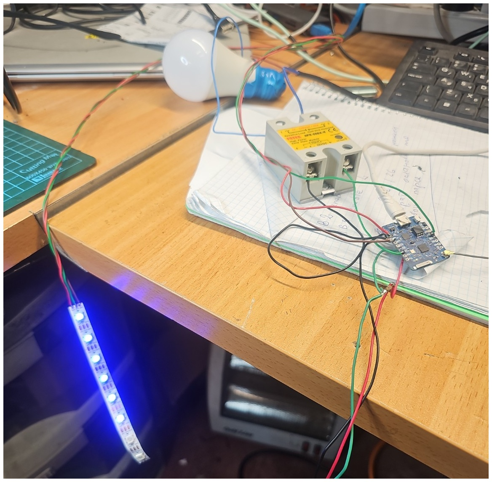

# fridge-thermostat-esp8266

Smart refrigerator thermostat based on **Wemos D1 mini Pro**, **DS18B20**, **SSR**, **OLED**, **NeoPixel**, a local web interface, and optional **Home Assistant MQTT Discovery**.



## Overview

This project is a compact refrigerator / display-cooler controller built on ESP8266.

It:

- measures temperature with a **DS18B20**
- controls the compressor through an **SSR**
- displays temperature and status on a small **OLED**
- uses an **8-pixel WS2812 / NeoPixel strip** for visual temperature indication
- creates its own Wi-Fi access point with a built-in web page
- can connect to a normal Wi-Fi network and publish data to Home Assistant over MQTT

The thermostat logic runs locally on the Wemos, so cooling control continues even when Wi-Fi, Home Assistant, or MQTT is unavailable.

## Features

- Adjustable compressor ON and OFF temperature thresholds
- Minimum compressor restart delay
- Maximum continuous compressor run time
- Sensor-error fallback cycle
- Settings saved in flash memory
- Local Wi-Fi access point
- Built-in web interface
- Large OLED temperature display
- Color temperature indication with NeoPixel
- Home Assistant MQTT Discovery
- MQTT control of thresholds and cooling enable state

## Hardware

- Wemos D1 mini Pro / ESP8266
- DS18B20 temperature sensor
- SSR suitable for the compressor load
- 0.96" 128×64 OLED I2C display
- WS2812 / NeoPixel LED strip, 8 pixels
- 4.7 kΩ resistor for DS18B20 pull-up
- 5 V power supply
- Small refrigerator / display cooler

## Pinout

| Wemos pin | Connected device |
|---|---|
| **D1 / GPIO5** | SSR control |
| **D2 / GPIO4** | DS18B20 data |
| **D5 / GPIO14** | NeoPixel data |
| **D6 / GPIO12** | OLED SDA |
| **D7 / GPIO13** | OLED SCL |

## Wiring notes

### DS18B20

- VCC → 3.3 V
- GND → GND
- DATA → D2
- 4.7 kΩ resistor between DATA and 3.3 V

### SSR

- Control input → D1
- Control GND → GND

The firmware expects:

- D1 HIGH → SSR ON
- D1 LOW → SSR OFF

### OLED

- SDA → D6
- SCL → D7
- VCC → 3.3 V
- GND → GND
- Default I2C address: `0x3C`

### NeoPixel strip

- DIN → D5
- 5 V → 5 V
- GND → GND

The Wemos and LED strip must share a common ground.

## Default control logic

- Compressor ON threshold: `6.0 °C`
- Compressor OFF threshold: `3.0 °C`
- Minimum restart delay: `60 seconds`
- Maximum continuous compressor run time: `1 hour`
- Sensor-error fallback:
  - 20 minutes ON
  - 40 minutes OFF

The OFF threshold must always be lower than the ON threshold.

## Web interface

The controller creates its own access point:

- SSID: `Fridge-Control`
- Default password: `12345678`
- Default address: `192.168.4.1`

The web page allows you to:

- view the current temperature
- see compressor state
- enable or disable cooling
- change ON and OFF thresholds
- force the compressor OFF
- check Wi-Fi and MQTT state

Change the default access-point password before using the controller in a public or shared location.

## Home Assistant and MQTT

The firmware supports:

- temperature sensor
- cooling enable switch
- compressor binary sensor
- sensor-error binary sensor
- adjustable ON threshold
- adjustable OFF threshold
- MQTT availability
- Home Assistant MQTT Discovery

Before compiling, edit these values in the sketch:

```cpp
const char* STA_SSID = "YOUR_WIFI_NAME";
const char* STA_PASS = "YOUR_WIFI_PASSWORD";

const char* MQTT_HOST = "192.168.0.118";
const uint16_t MQTT_PORT = 1883;
const char* MQTT_USER = "";
const char* MQTT_PASSWORD = "";
```

Do not publish real Wi-Fi or MQTT passwords in a public repository.

## NeoPixel indication

- **Blue** — temperature is at or below the OFF threshold
- **Green** — temperature is in the normal range
- **Red** — temperature is at or above the ON threshold
- **Blinking red** — DS18B20 sensor error
- **Dim white** — cooling disabled

## OLED display

The OLED shows:

- current temperature in large digits
- compressor ON / OFF state
- compressor restart delay
- cooling state
- Wi-Fi and MQTT connection indicators

## Software and libraries

The firmware is written for the Arduino framework and ESP8266.

Tested with:

- ESP8266 Arduino Core `3.1.2`
- board FQBN: `esp8266:esp8266:d1_mini_pro`

### ESP8266 board support

- [ESP8266 Arduino Core](https://github.com/esp8266/Arduino)

Board package URL:

```text
https://arduino.esp8266.com/stable/package_esp8266com_index.json
```

### Required libraries

- [OneWire](https://github.com/PaulStoffregen/OneWire)
- [DallasTemperature](https://github.com/milesburton/Arduino-Temperature-Control-Library)
- [Adafruit GFX Library](https://github.com/adafruit/Adafruit-GFX-Library)
- [Adafruit SSD1306](https://github.com/adafruit/Adafruit_SSD1306)
- [Adafruit NeoPixel](https://github.com/adafruit/Adafruit_NeoPixel)
- [PubSubClient](https://github.com/knolleary/pubsubclient)

`ESP8266WiFi`, `ESP8266WebServer`, `EEPROM`, and `Wire` are included with the ESP8266 Arduino core.

## Installation with Arduino CLI

Install the ESP8266 core:

```bash
arduino-cli core update-index \
  --additional-urls https://arduino.esp8266.com/stable/package_esp8266com_index.json

arduino-cli core install esp8266:esp8266 \
  --additional-urls https://arduino.esp8266.com/stable/package_esp8266com_index.json
```

Install the required libraries:

```bash
arduino-cli lib install "OneWire"
arduino-cli lib install "DallasTemperature"
arduino-cli lib install "Adafruit GFX Library"
arduino-cli lib install "Adafruit SSD1306"
arduino-cli lib install "Adafruit NeoPixel"
arduino-cli lib install "PubSubClient"
```

## Compile and upload

Open a terminal in the repository folder:

```bash
arduino-cli compile \
  --fqbn esp8266:esp8266:d1_mini_pro \
  .

arduino-cli upload \
  -p /dev/ttyUSB0 \
  --fqbn esp8266:esp8266:d1_mini_pro \
  .
```

Open the serial monitor:

```bash
arduino-cli monitor \
  -p /dev/ttyUSB0 \
  -c baudrate=115200
```

Change `/dev/ttyUSB0` if the board appears on another serial port.

## Project photos

### Finished refrigerator


### Test wiring and electronics



## Repository files

- `fridge-thermostat-esp8266.ino`
- `fridge-front.jpg`
- `fridge-wiring.jpg`
- `README.md`

## Safety

> **Warning:** This project switches mains-powered refrigeration equipment.

Use:

- proper insulation
- an SSR or contactor suitable for compressor / motor loads
- correct current and voltage ratings
- fuses and electrical protection
- an enclosed, touch-safe installation

If you are not qualified to work with mains voltage, ask a licensed electrician to inspect and connect the mains side.

## Status

Tested on a real mini-fridge and working successfully in everyday use.

## Author

Created by **urab**.
